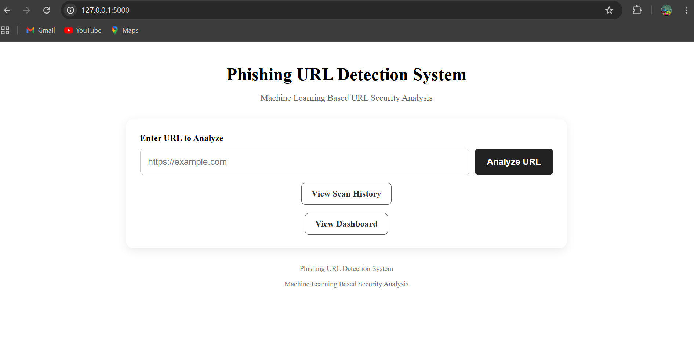
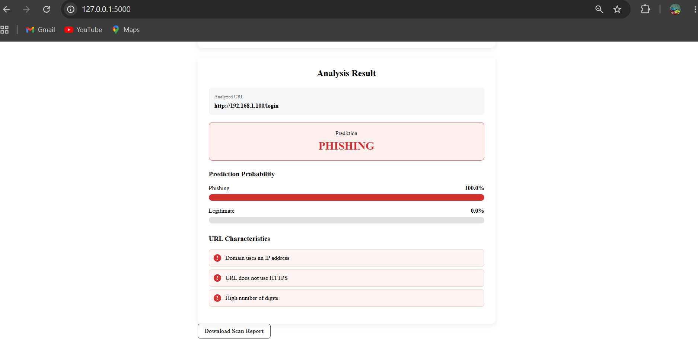
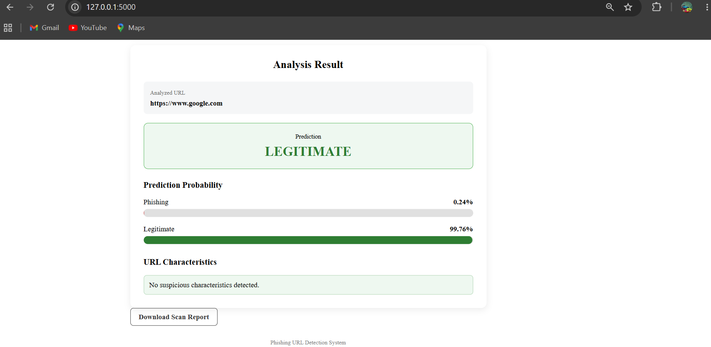
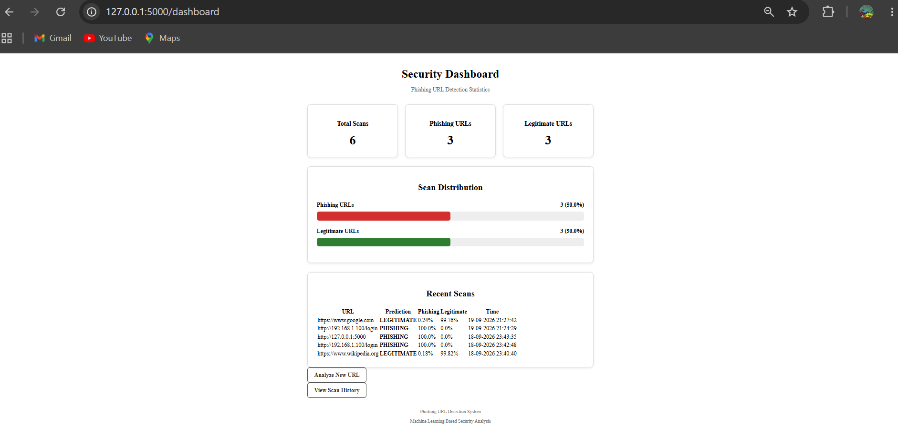
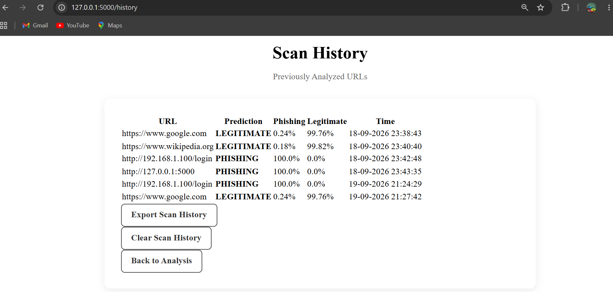

# Phishing URL Detection System

## Overview

The **Phishing URL Detection System** is a machine learning-based web application designed to identify whether a URL is **legitimate or potentially phishing**.

The system extracts various characteristics from a URL and uses a trained **Random Forest machine learning model** to classify the URL. It also provides phishing and legitimate probabilities along with information about suspicious URL characteristics.

The system is implemented using **Python and Flask** and provides a web-based interface for URL analysis, scan history, and security monitoring.

## Features

* URL feature extraction
* Machine learning-based phishing URL classification
* Phishing probability
* Legitimate probability
* Suspicious URL characteristic detection
* HTTPS and domain analysis
* Flask-based web interface
* Scan history
* Security dashboard
* Recent scan display
* Clear scan history
* Export scan history to CSV
* Download individual scan reports
* Invalid URL validation

## Technologies Used

* **Python**
* **Flask**
* **Pandas**
* **Scikit-learn**
* **Joblib**
* **HTML5**
* **CSS3**
* **Machine Learning**
* **Random Forest**

## How the System Works

The system follows these main steps:

```text
User enters URL
       ↓
URL validation
       ↓
URL feature extraction
       ↓
Machine learning model
       ↓
Prediction
       ↓
Phishing / Legitimate
       ↓
Probability & URL characteristics
       ↓
Scan history and dashboard
```

### 1. URL Input

The user enters a URL through the Flask web interface.

### 2. URL Feature Extraction

The system analyzes characteristics of the URL, including:

* URL length
* Domain length
* Whether the domain is an IP address
* TLD length
* Number of subdomains
* Obfuscation characteristics
* Number of letters and digits
* Digit ratio
* Number of special characters
* HTTPS usage

### 3. Machine Learning Classification

The extracted features are passed to a trained **Random Forest classifier**.

The model classifies the URL as:

* **LEGITIMATE**
* **PHISHING**

### 4. Result Analysis

The application displays:

* Prediction
* Phishing probability
* Legitimate probability
* Suspicious URL characteristics

The result is also recorded in the scan history.

## Machine Learning Model

The project uses a **Random Forest classifier** for phishing URL detection.

The model was trained using a phishing URL dataset containing **235,795 URLs**.

The dataset was processed and relevant URL features were extracted before training the model.

### Model Evaluation

The URL-only Random Forest model achieved the following evaluation results:

| Metric    |  Score |
| --------- | -----: |
| Accuracy  | 99.73% |
| Precision | 99.59% |
| Recall    | 99.94% |
| F1 Score  | 99.76% |

These results are based on the project's test set and should be interpreted as evaluation results on that dataset, not as a guarantee of performance on previously unseen real-world URLs.

## Example Predictions

### Legitimate URL

```text
https://www.google.com
```

Prediction:

```text
LEGITIMATE
```

The trained consistent model classified the URL as legitimate with a high legitimate probability.

### Phishing Example

```text
http://192.168.1.100/login
```

Prediction:

```text
PHISHING
```

The system identified characteristics including:

* Domain uses an IP address
* URL does not use HTTPS
* High number of digits

## Project Structure

```text
Phishing-URL-Detection-System
│
├── app.py
├── predict_url.py
├── url_feature_extraction.py
├── check_dataset.py
├── prepare_dataset.py
├── feature_analysis.py
├── evaluate_model.py
├── train_model.py
├── train_url_model.py
├── train_consistent_model.py
├── README.md
├── .gitignore
│
├── model
│   └── consistent_url_phishing_model.pkl
│
├── templates
│   ├── index.html
│   ├── history.html
│   └── dashboard.html
│
├── static
│   └── style.css
│
└── reports
    ├── confusion_matrix.png
    ├── feature_importance.csv
    ├── feature_importance.png
    └── roc_curve.png
```

> **Note:** The dataset files and automatically generated `scan_history.csv` are excluded from the GitHub repository using `.gitignore`.

## Installation

### 1. Clone the repository

```bash
git clone https://github.com/Sarangii4532/Phishing-URL-Detection-System.git
```

### 2. Open the project directory

```bash
cd Phishing-URL-Detection-System
```

### 3. Install the required Python packages

```bash
pip install flask pandas scikit-learn joblib
```

### 4. Run the application

```bash
python app.py
```

The Flask application will start locally.

Open the displayed local address in a web browser to access the phishing URL detection interface.

## Application Interface

The web application provides:

* URL scanning interface
* Prediction results
* Security dashboard
* Scan history
* Recent scan information
* CSV export
* Individual scan report downloads
* Scan history management

## Reports

The project includes model evaluation and analysis reports such as:

* Confusion matrix
* ROC curve
* Feature importance analysis

These reports help evaluate the machine learning model and understand the contribution of URL characteristics to the classification process.
## Application Screenshots

### Main URL Analysis Interface



### Phishing URL Detection



### Legitimate URL Detection



### Security Dashboard



### Scan History



## Future Enhancements

Possible future improvements include:

* Real-time URL reputation checking
* Integration with external threat intelligence services
* Larger and more diverse datasets
* Deep learning-based URL classification
* Browser extension integration
* Domain and certificate information analysis
* Automated model retraining
* Cloud deployment
* Improved phishing explanation and risk scoring

## Disclaimer

This project is developed for **educational and research purposes**. Machine learning predictions can contain errors, and the system should not be considered a replacement for professional cybersecurity or threat-intelligence solutions.
